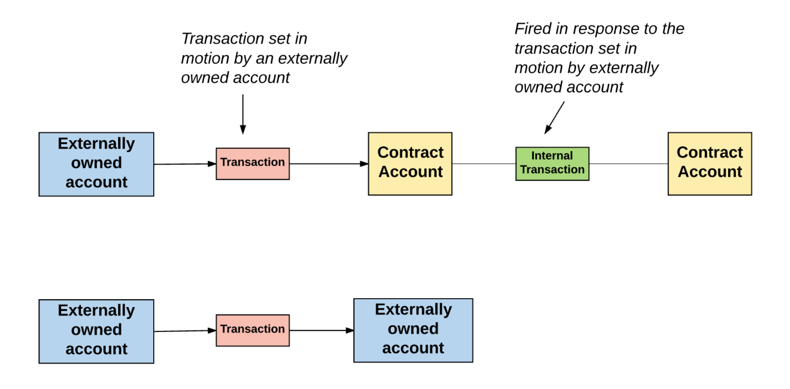

# Module 1: Solidity and Hardhat basics
## Introduction to blockchain. [link](https://www.youtube.com/watch?v=bBC-nXj3Ng4&t=25s&ab_channel=3Blue1Brown)

How does Bitcoin works?
- Sistema descentralizado basado en matematicas para criptografia que ayuda a verificar transacciones.
- Es un sistema para que por ejemplo veamos las transacciones que se hagan publicamente, tambien cualquiera puede editar esto, aunque para que nadie mas que el dueño pueda tocar su dinero, hay varias cosas a tener en cuenta.
  - Digital Signature: Firma que tenga que tu hiciste y aprobaste la transaccion. Todos tienen una public/private key. (256 bit signature)
    - pk and sk: pk ayuda a descencriptarla, sk (secret key) nos ayuda a firmarla con el mensaje de la transaccion, para desencriptarla se hace un verificacion de mensaje con la firma y la public key.
  - Unique id: De esta forma no se puede copiar y pegar unna misma transaccion
  - Overspending: No deja que una persona gaste mas de lo que obtiene, todos ponen lo que tienen en un lugar y no dejara que tu pidas mas de lo que vale lo que tienes en ese lugar, saber el historial.
- El bitcoin tiene las transacciones.
- Crypotographic  Hash Function
- Proof of work
- BlockChain
  
## How does Ethereum work anyway? [link](https://www.preethikasireddy.com/post/how-does-ethereum-work-anyway)
- Public database that keeps a permanent record of digital transactions.
- doesn't require any central authority. trustless, peer to peer transactions.
- Blockchain:
  - Cryptographically secure.
  - Transactional singleton machine
  - With shared state.
- Ethereum Blockchain:
  - transaction based stte machine, In computer science, a state machine refers to something that will read a series of inputs and, based on those inputs, will transition to a new state.
  - stars with a genesis state. This is analogoes to a blank slate, beforre any transactions have happedned on the network. When transactions are executed, this genesis state transitions into some final state.
  - For a block to be added to the mainn blockchainn, the miner must prove it faster than any other competitor miner. The process of validating each block by having a miner provide a mathematical proof is know as a "**proof of work**"
  - TO determine which path is most valid and prevent multiple chains, ethereum uses a mechanism called the **GHOST** protocol, **G**reedy **H**eaviest **O**bserved **S**ubtree.
  - GHOST protocol says we must pick the path tha has had the most computation done upon it.
  - Main Components.
    - Acounts:
      - Small objects that are able to interect with one anothherr through a message passing frameworrk. Each account has a stated associated with it and a 20 byte address. The address is an indentier.
      - There are two types of accounts:
        - Externally owned accounts, which are controlled by private keys and have no code associated with them.
        - Contract accounts, which are controlled by their contract code and have code associated with them.
        - **An externally owned account can send messages to other externally owned accounts OR to other contract accounts by creating and signing a transaction using its private key.** A message between two externally owned accounts is simply a value transfer.
        - **A message from an externally owned account to a contract account activates the contract account’s code, allowing it to perform various actions** (e.g. transfer tokens, write to internal storage, mint new tokens, perform some calculation, create new contracts, etc.).

    - Account State:
      - Consists of four components:
        - **nonce**: if the account is external, this number represents the numbere of transactions sent from the account's address. if the account is a contract account, the nonce is the number of conntracts created by the account.
        - **balance**: The numer of Wei owned by this address. there arer 1e+18 Wei per Ether.
        - **storageRoot**: A hash of the root node of a **Merkle Patricia tree**. This tree encodes the hash of the storage contents of this account, and is empty by default.
        - **codeHash**: The hash of the **EVM** (Ethereum Virtual Machine) code of this account. For contract accounts, this is the code that gets hashed and stored as the codeHash. For external owned accounts, the codeHash field is the hash of the empty string.
    - World state:
      - The ethereum global state consists of a mapping between account addresses and the account states. This mapping is stored in a data structure known as a **Merkle Patricia tree** a type of binary tree composed of a set of nodes with:
        - a large number of leaf nodes at the bottom of the tree that contain the unudererlyaing data
        - a set of inntermediate nodes, where each node is the hash of its two child nodes.
        - a single root node, also formed from the hash of its two child node, representing the top of the tree
      - this tree is required to have a key for every valuee stored inside it.